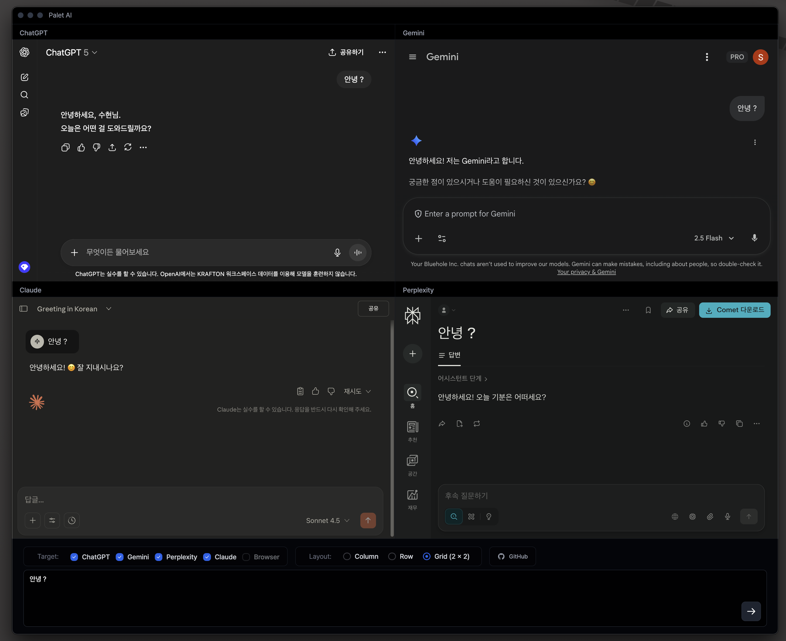

<div align="center">
  
  
  # Palet AI
  
  **The easiest way to use multiple AI services simultaneously in one screen**
  
  Run and compare ChatGPT, Google Gemini, Claude, and Perplexity side by side.
  
  
  
  [](LICENSE.md)
  
  
  
</div>

---

## ✨ Key Features

### 🎯 Ask Multiple AIs at Once

Send questions to multiple AI services from a single input field. Compare responses from ChatGPT, Gemini, Claude, and Perplexity at a glance.

### 🎨 Flexible Layouts

- **Column Layout**: Stack AIs vertically
- **Row Layout**: Arrange AIs horizontally
- **2×2 Grid**: Display 4 screens in a grid

### 🔍 Integrated Browser

Web search is also available. Compare AI responses with actual search results simultaneously.

### 💾 Automatic Login Persistence

Once you log in, your session is automatically saved. You can start using it immediately on the next launch.

### 🎭 Dark Mode

Comes with an eye-friendly dark theme.

---

## 📥 Download & Installation

### macOS (Apple Silicon)

```bash
# Clone the repository
git clone https://github.krafton.com/sh-chae/multi-ai-electron.git
cd multi-ai-electron

# Install dependencies
npm install

# Build the app
npm run dist:mac:arm64
```

The built app can be found in the `dist/` folder.

### Windows

```bash
npm run dist:win
```

### Linux

```bash
npm run dist:linux
```

---

## 🚀 How to Use

### 1️⃣ Getting Started

When you launch the app, you'll see the login screens for each AI service. Log in to the services you want to use.

### 2️⃣ Asking Questions

- Enter your question in the input field at the bottom
- **Enter**: Send question
- **Shift + Enter**: New line

### 3️⃣ Service Selection

If you want to use only specific AIs, you can select/deselect them using the checkboxes at the bottom.

### 4️⃣ Changing Layout

Freely adjust the screen arrangement with the Column/Row/Grid buttons.

---

## 💡 Use Cases

### 📚 Learning & Research

Get more accurate information by comparing responses from multiple AIs.

### ✍️ Writing

Receive ideas from various perspectives at once.

### 🔍 Information Search

Fact-check by viewing AI responses and actual web search results simultaneously.

### 💻 Coding

Compare code suggestions from multiple AIs and choose the optimal solution.

---

## ⚙️ Development Environment

### Requirements

- Node.js 16 or higher
- npm or yarn

### Running in Development Mode

```bash
# Install dependencies
npm install

# Start development server
npm run dev

# Run Electron in a separate terminal
npm run dev:electron
```

---

## 🎨 Tech Stack

- **Electron 30** - Cross-platform desktop app framework
- **React 18** - UI framework
- **TypeScript** - Type safety
- **Tailwind CSS 3** - Utility-first styling
- **Vite** - Fast build tool
- **Pretendard** - Optimized font for Korean/English

---

## 📝 License

MIT License - Free to use, modify, and distribute.

---

## 👤 Author

**[@cha2hyun](https://github.krafton.com/sh-chae)**

---

## 🔗 Links

- [GitHub Repository](https://github.krafton.com/sh-chae/multi-ai-electron/)
- [Issue Reports](https://github.krafton.com/sh-chae/multi-ai-electron/issues)

---

<div align="center">
  
  **Use AI smarter with Palet AI! 🎨✨**
  
  Made with ❤️ by @cha2hyun
  
</div>
